# Meshtastic en el PortaPack: guía

Idiomas: [Русский](guide.ru.md) | [English](guide.en.md) | [Deutsch](guide.de.md) | **Español**

La aplicación está en **Transceiver → Mesh**. Arriba hay cuatro pestañas: Chat, Nodes, Data,
Setup. Se pasa de una a otra con el dedo o con la cruceta.

## Contenido

- [Chat](#chat)
- [Conversaciones y canales](#conversaciones-y-canales)
- [Ajustes del chat](#ajustes-del-chat)
- [Lista de nodos](#lista-de-nodos)
- [Ficha del nodo](#ficha-del-nodo)
- [Ajustes](#ajustes)
- [Para empezar](#para-empezar)

## Chat

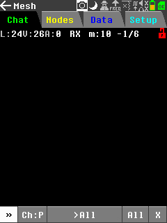

La línea superior muestra el estado de la radio y del enlace:

| campo | qué significa |
|---|---|
| `L:24V:26A:0` | ganancia del receptor: LNA, VGA y atenuador |
| `RX` | hacia dónde mira la radio ahora. `[RX]` o `[TX]` entre corchetes significa que la dirección está fijada en los ajustes |
| `m:10` | cuántos mensajes hay en el historial |
| `-1/6` | nivel y calidad del último paquete recibido |

Los botones de abajo:

| botón | qué hace |
|---|---|
| `»` | abre el teclado y envía lo escrito |
| `Ch:P` | el canal actual. `P` es el principal, una cifra es uno propio |
| `>All` | a quién va dirigido. Al pulsarlo recorre: a todos, y luego cada nodo conocido |
| `All` | qué mostrar: todo o solo la conversación |
| `X` | limpiar la pantalla |

El campo `RX`/`TX` se alcanza con la cruceta, que lo resalta en blanco, y se cambia con el
botón central. Tres posiciones: enviar y recibir, solo transmitir, solo recibir.

### Leer una conversación

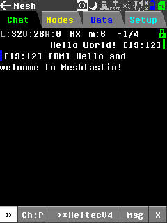

Los mensajes propios van a la derecha, los ajenos a la izquierda. La hora va entre corchetes.
La marca `[DM]` indica un mensaje privado en lugar del canal compartido.

El punto de color junto al mensaje propio indica la entrega:

- **amarillo**: enviado, todavía sin respuesta
- **verde**: recibido
- **rojo**: no llegó confirmación

En un mensaje para todos, el verde significa que un vecino lo tomó, lo reenvió y nosotros
oímos volver nuestro propio paquete. Esa es la prueba de que alguien escucha.

## Conversaciones y canales

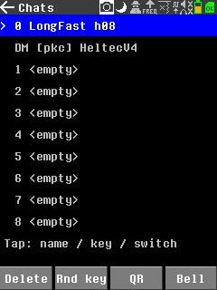

Se abre con el botón `Ch:` del chat.

La línea de arriba es el canal principal: su nombre y su resumen, por ejemplo `LongFast h08`.
El resumen es el único byte que Meshtastic pone en el paquete en lugar del nombre del canal, y
se calcula a partir del nombre y de la clave. Dos nodos con resúmenes distintos no se oyen,
aunque ambas pantallas parezcan iguales. Por eso se muestra aquí.

La línea `DM [pkc] HeltecV4` es una conversación privada. `[pkc]` significa que se conoce la
clave pública de ese nodo y que se cifra solo para él.

Debajo hay ocho espacios para canales propios. Pulsar uno hace cosas distintas según su estado:

- **espacio vacío**: pide un nombre, crea el canal y lo deja como actual
- **canal actual**: pide una contraseña, tras lo cual el canal queda cifrado
- **otro espacio ocupado**: cambia a él
- **canal principal arriba**: vuelve al compartido

Los botones de abajo: `Delete` borra el canal actual, `Rnd key` pone una clave aleatoria, `QR`
muestra el canal como código para llevarlo al teléfono, `Bell` envía una llamada sonora.

**Sobre la compatibilidad.** La forma de convertir una contraseña en clave es propia de esta
aplicación, no de Meshtastic. Dos PortaPack con la misma contraseña se entenderán. Para hablar
con un nodo de serie en un canal propio, escriba la clave real de ese nodo, 32 caracteres
hexadecimales, en lugar de la contraseña. El canal principal es compatible de entrada, porque
usa la clave conocida por todos.

## Ajustes del chat

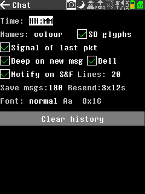

| campo | qué hace |
|---|---|
| `Time` | formato de la hora junto a los mensajes |
| `Names: colour` | teñir los nombres con el color de cada nodo |
| `SD glyphs` | tomar de la tarjeta una tabla de caracteres para que se lean el cirílico y otros alfabetos |
| `Signal of last pkt` | mostrar el nivel de señal en la línea superior |
| `Beep on new msg`, `Bell` | sonido al recibir |
| `Notify on S&F` | avisar cuando un paquete se guarda para entregarlo más tarde |
| `Lines` | cuántas líneas de historial conservar, unos 40 bytes cada una |
| `Save msgs` | cuántos mensajes guardar en la tarjeta |
| `Resend` | cuántas veces repetir un mensaje sin confirmar y con qué intervalo |
| `Font` | tamaño de los caracteres |
| `Clear history` | borra las conversaciones. Las claves y el registro de paquetes se conservan |

## Lista de nodos

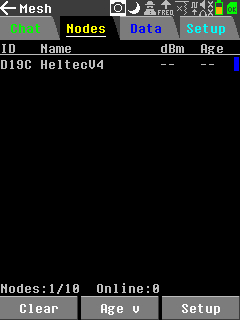

Todos los que se han oído. Las columnas son las cuatro últimas cifras del número de nodo, el
nombre, el nivel de señal y la antigüedad. La franja de la derecha es el color del nodo, el
mismo con el que se tiñen sus mensajes en el chat.

El contador de abajo dice cuántos nodos hay guardados de los posibles y cuántos están
accesibles. Diez es el límite firme: la lista vive en memoria de forma permanente, y este
aparato tiene poca.

`Age v` invierte el orden, `Clear` vacía la lista, `Setup` abre sus ajustes.

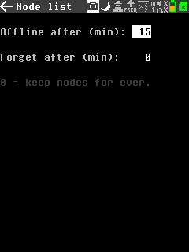

`Offline after` son los minutos de silencio tras los cuales un nodo se da por ausente.
`Forget after` es cuándo se borra del todo; cero significa conservarlo siempre.

## Ficha del nodo

Se abre pulsando una fila de la lista. Nueve páginas, elegidas con el campo de arriba.

### Identidad

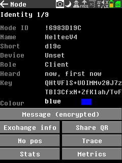

El número, el nombre, el nombre corto, la placa y el papel en la red. `Heard` da la última vez
y la primera.

`Key` es la clave pública del nodo. Mientras no llegue, un mensaje privado se cifra con la
clave del canal y no solo para ese nodo. La clave viaja únicamente en la presentación de un
nodo, y para eso sirve `Exchange info`: envía la nuestra y pide la ajena.

`Colour` elige el color con el que se tiñen los mensajes de ese nodo.

Los botones de abajo funcionan en las nueve páginas:

| botón | qué hace |
|---|---|
| `Message` | conversación privada con ese nodo |
| `Exchange info` | intercambiar presentaciones, que es como llega la clave |
| `Share QR` | mostrar el nodo como código para el teléfono |
| `Map` | mostrarlo en el mapa, o `No pos` si nunca envió posición |
| `Trace` | preguntar por qué camino se llega a él; la respuesta aparece en el chat |
| `Stats` | pedir los contadores del enrutador |
| `Metrics` | pedir batería, tensión y tiempo en el aire |

### Radio

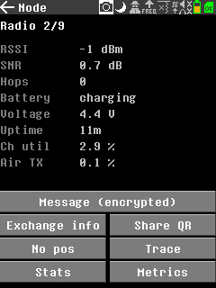

Nivel y calidad de señal, número de saltos, batería, tensión, tiempo encendido, ocupación del
canal y parte del tiempo dedicada a transmitir.

El nivel de señal **no está calibrado**. Las muestras del HackRF son de ocho bits, con unos
42 dB de margen útil, así que el número sirve para comparar nodos entre sí, pero no son dBm
reales. Para un valor verdadero, mire lo que indica el nodo de serie del otro lado.

### Contadores

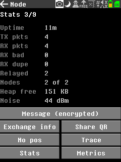

Recibidos, enviados, defectuosos, duplicados, reenviados, nodos conocidos, memoria libre y
nivel de ruido. Llegan al pulsar `Stats`.

Un nodo Meshtastic de serie normalmente **no responde** a esa petición: esos contadores están
pensados para un teléfono conectado al nodo. Entre dos PortaPack sí funciona.

Las páginas `Environ`, `Weather`, `Air qual`, `Power` y `Health` muestran lecturas de sensores
cuando el nodo las envía. Cuando no, la página dice `not reported` en lugar de quedarse vacía.

## Ajustes

### Perfil

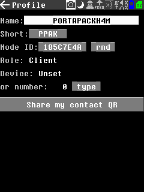

El nombre y el nombre corto que verán los demás. El número de nodo se puede escribir o sortear
con el botón `rnd`.

`Role` es el papel en la red. `Client` sirve para casi todos. Los papeles de enrutador cambian
la forma de reenviar paquetes ajenos, y conviene no tocarlos sin motivo.

`Device` permite presentarse como otra placa, si prefiere parecer un nodo habitual en la lista
de otra persona.

### Radio

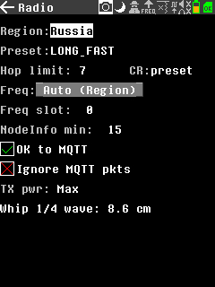

**Elija primero su región.** De ella depende la frecuencia, y con una región ajena no habrá
enlace alguno aunque todo lo demás parezca correcto.

| campo | qué hace |
|---|---|
| `Preset` | el modo de modulación. `LONG_FAST` viene de fábrica en todos los nodos de serie |
| `Hop limit` | cuántas veces puede reenviarse un paquete |
| `CR` | tasa de codificación, normalmente tomada del preset |
| `Freq` | frecuencia: según la región o fijada a mano |
| `Freq slot` | qué hueco de frecuencia dentro de la región |
| `NodeInfo min` | cada cuánto presentarse |
| `OK to MQTT` | si las pasarelas pueden publicar nuestros paquetes en internet |
| `Ignore MQTT pkts` | ocultar los paquetes llegados por internet |
| `TX pwr` | potencia de transmisión |

Abajo, `Whip 1/4 wave` da la longitud de un cuarto de onda para la frecuencia actual. Un hilo
de esa medida sobre una base metálica funciona bastante mejor que una antena del juego cortada
para otra banda.

### Privacidad

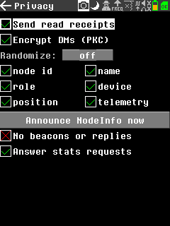

| campo | qué hace |
|---|---|
| `Send read receipts` | confirmar que un mensaje fue leído |
| `Encrypt DMs (PKC)` | cifrar los mensajes privados solo para el destinatario |
| `Randomize` | cambiar periódicamente los datos marcados debajo |
| `Announce NodeInfo now` | presentarse de inmediato |
| `No beacons or replies` | silencio completo: no decir nada ni responder a nada |
| `Answer stats requests` | responder a las peticiones de contadores y medidas |

**Cuidado con el silencio.** Con `No beacons or replies` activado, el nodo nunca envía su
presentación, y la clave pública viaja solo dentro de ella. Sin la clave nadie podrá
escribirle en privado, y no verá por qué fallan los mensajes.

### Sistema

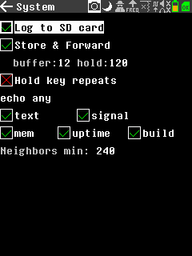

| campo | qué hace |
|---|---|
| `Log to SD card` | llevar un registro de paquetes en la tarjeta |
| `Store & Forward` | retener mensajes para nodos que ahora no se oyen |
| `buffer`, `hold` | cuántos mensajes guardar y durante cuántos minutos |
| `Hold key repeats` | repetición al mantener pulsada una tecla |
| `echo any` | devolver como eco cualquier mensaje que llegue |
| `text`, `signal`, `mem`, `uptime`, `build` | qué añadir al eco |
| `Neighbors min` | cada cuánto informar de los vecinos |

El eco es la manera cómoda de probar el alcance: un mensaje desde el otro extremo comprueba
las dos direcciones a la vez. Si el eco vuelve, le oyeron y usted oyó la respuesta.

## Para empezar

1. **Setup → Radio**, elegir la región. Antes de eso no funciona nada
2. **Setup → Profile**, poner un nombre
3. Volver al **Chat** y esperar: los vecinos se presentan solos, casi siempre en unos minutos
4. Escribir al canal compartido con el botón `»`

Si tras unos minutos no aparece nadie, compruebe tres cosas en el otro extremo: la región, el
preset y el nombre del canal principal. Una diferencia en cualquiera de los tres deja a los dos
nodos sordos entre sí.
